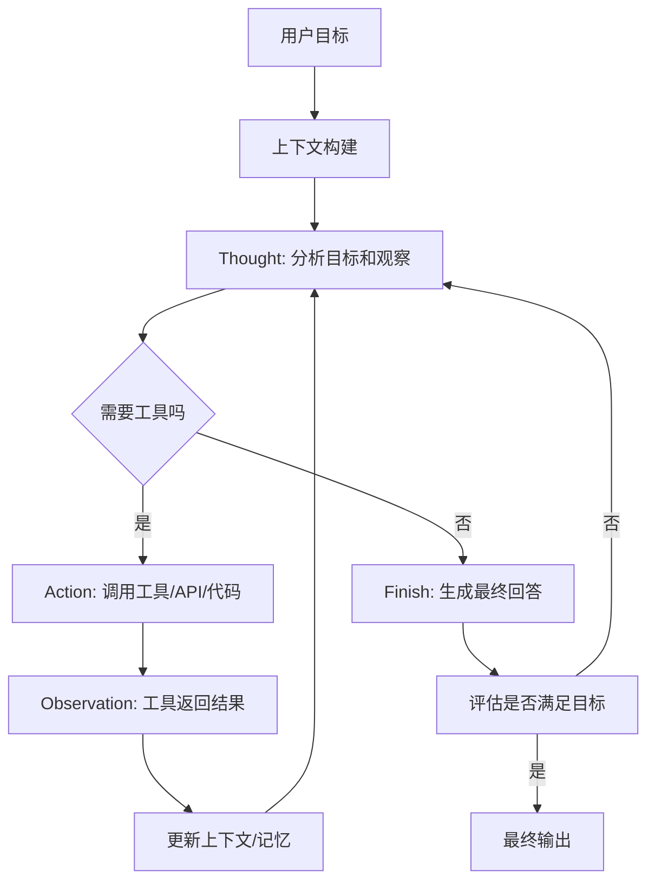

# HelloAgents 架构笔记：第 1 章 初识智能体

> 状态：已学第一遍  
> 对应文件：`C:\Users\50469\github-projects\hello-agents\docs\chapter1\第一章 初识智能体.md`

---

## 这一章解决什么

这一章回答的是“Agent 到底是什么，以及它为什么不是普通 ChatBot”。传统定义里，Agent 是能通过传感器感知环境、通过执行器采取行动、并围绕目标自主决策的实体。LLM 出现后，Agent 的核心变化是：模型可以处理模糊自然语言目标，并把目标拆成计划、工具调用、观察反馈和动态修正。对你来说，这一章最重要的不是代码，而是建立 `感知 -> 思考 -> 行动 -> 观察` 的闭环。

## 核心模块

| 模块 | 职责 | 输入 | 输出 | 状态 / 依赖 |
|------|------|------|------|-------------|
| User Goal | 用户提出目标 | 自然语言需求 | 任务目标 | 用户上下文 |
| Context Builder | 构造上下文 | 用户输入、历史、配置 | prompt/context | Memory/Config |
| Planner | 决定下一步 | 上下文、目标 | 计划/动作 | 策略 |
| Tool Executor | 执行工具 | action/tool args | observation | 工具权限 |
| Memory | 保存/召回信息 | 对话、事实、文档 | 相关上下文 | 存储 |
| Evaluator | 判断结果 | 过程和输出 | 是否完成/是否重试 | 评估标准 |

## 本章关键词

| 关键词 | 你要怎么理解 |
|--------|--------------|
| Environment | Agent 所处的外部世界，可以是网页、数据库、API、文件系统或真实物理世界 |
| Sensors | 感知入口，在 LLM Agent 中通常是用户输入、API 返回、日志、文件内容 |
| Actuators | 执行器，在 LLM Agent 中通常是工具调用、代码执行、HTTP 请求、文件修改 |
| Autonomy | 自主性，不是死板执行脚本，而是根据目标和观察决定下一步 |
| PEAS | 用 Performance、Environment、Actuators、Sensors 描述任务环境 |
| Agent Loop | 感知、思考、行动、观察的循环 |
| Thought-Action-Observation | LLM Agent 的结构化交互协议 |

## 工作流



## 输入输出

| 阶段 | 输入 | 输出 | 失败情况 |
|------|------|------|----------|
| 用户输入 | 目标、问题、约束 | 任务描述 | 需求模糊 |
| 上下文构建 | 历史、配置、文件、规则 | prompt/context | 上下文太长或缺失 |
| Thought / 规划 | context、observation | plan/action | 计划不可执行 |
| Action / 工具调用 | tool name + args | 原始工具结果 | 权限、参数、超时 |
| Observation / 感知封装 | JSON、日志、文件、API 返回 | 给 LLM 看的简洁观察 | 信息噪声过大 |
| 记忆 / 检索 | query/context | recalled context | 召回不准 |
| 最终输出 | context + observation | answer/result | 幻觉或不完整 |

## 关键设计点

- Agent 不是“更会聊天的模型”，而是围绕目标循环执行的系统。
- Agent 需要目标、环境、感知、行动、自主决策，否则只是普通 LLM 调用。
- LLM Agent 的优势是能理解高层级、模糊、有上下文的自然语言任务，并动态修正计划。
- PEAS 是设计 Agent 前的任务环境分析工具：先问性能指标、环境、执行器、传感器分别是什么。
- Thought-Action-Observation 是把“模型推理”和“真实世界工具执行”接起来的协议。
- 工程里最重要的不是概念名词，而是输入输出和失败处理。

## Agent 类型速记

| 类型 | 解决什么问题 | 局限 |
|------|--------------|------|
| 简单反射 Agent | 条件满足就执行动作，速度快 | 没有记忆和上下文 |
| 基于模型 Agent | 用内部状态补全不可见环境 | 依赖世界模型质量 |
| 基于目标 Agent | 会为了目标规划路径 | 多目标权衡弱 |
| 基于效用 Agent | 在多个目标间取最优满意度 | 需要效用函数 |
| 学习型 Agent | 通过反馈改进策略 | 成本高、训练复杂 |
| LLM Agent | 用模型做规划、工具选择和语言理解 | 可能幻觉，需要工具、约束和评估 |

## 不要死扣的代码

- `requests`、`tavily-python`、`openai` 这些库的细节现在不用深挖。
- 天气工具、景点搜索工具只是为了说明“工具调用”，不用当成项目核心。
- 教程里为了演示存在的解析器、工具字典、LLM client，不需要逐行背。
- 和你当前目标无关的大型案例细节先放下。

## 真正要理解的伪代码

```pseudo
goal = parse_user_goal(user_input)
peas = define_task_environment(goal)
context = build_context(goal, memory, config, available_tools)

while not finished:
    thought, action = llm.decide_next_step(context)

    if action.is_tool_call:
        raw_result = tool_executor.run(action.tool_name, action.args)
        observation = perception.wrap(raw_result)
        context = context.update(thought, action, observation)
        memory.save_if_needed(observation)
    else:
        answer = action.final_answer
        finished = evaluator.check(answer, goal, peas.performance)

return answer
```

## PEAS 视角：旅行助手例子

| PEAS | 旅行助手里是什么 |
|------|------------------|
| Performance | 推荐是否合理、是否满足预算/天气/时间、用户是否满意 |
| Environment | 天气 API、地图/景点信息、酒店/交通信息、用户反馈 |
| Actuators | 调用天气工具、搜索工具、预订接口、输出行程 |
| Sensors | 用户输入、API 返回、搜索结果、历史对话 |

## 和 AI-Meeting 的对应

- 出题 Agent：根据简历和岗位上下文生成问题。
- 评分 Agent：根据用户回答和评分标准输出评价。
- 追问 Agent：根据评分和规则判断是否追问。
- 面试状态机：相当于 Agent Loop 的状态控制，决定当前能不能上传简历、答题、评分、追问、结束。
- Redis/Mongo/MySQL：分别承担快照、消息历史、业务记录等状态保存，让长会话可恢复。
- SSE/WebSocket：相当于观察和行动结果的实时传输通道。

用 PEAS 看 AI-Meeting：

| PEAS | AI-Meeting 中的对应 |
|------|--------------------|
| Performance | 面试问题质量、评分准确性、追问合理性、报告完整性 |
| Environment | 用户简历、岗位、历史回答、AI 模型、Redis/Mongo/MySQL |
| Actuators | 出题、评分、追问、保存记录、推送 SSE/语音结果 |
| Sensors | 用户回答、简历文本、前端事件、ASR 文本、历史状态 |

## 和 Codex / Claude Code Harness 的对应

- 用户目标：issue、需求、`AI_HANDOFF/01_REQUIREMENT.md`。
- 上下文构建：读 `AGENTS.md`、README、相关代码。
- 规划：`02_PLAN.md` 或 Codex 的实现计划。
- 工具执行：shell、apply_patch、测试命令、git。
- 评估：测试是否通过、diff 是否符合任务单。
- 记忆/证据：`04_REVIEW.md`、学习笔记、提交记录。

用 PEAS 看 Codex：

| PEAS | Codex / Claude Code Harness 中的对应 |
|------|-------------------------------------|
| Performance | 需求是否完成、测试是否通过、改动是否可解释 |
| Environment | 本地仓库、文件系统、终端、测试框架、Git 状态 |
| Actuators | shell、apply_patch、文件读取、测试命令 |
| Sensors | 用户任务、文件内容、命令输出、测试失败信息 |

## 面试讲法

> 我理解的 Agent 不是单次调用大模型，而是一个围绕目标持续感知、思考、行动和观察的系统。LLM Agent 的核心是把自然语言目标拆成计划，通过工具调用获取真实环境信息，再把 Observation 写回上下文继续推理。这个思路可以迁移到 AI-Meeting：出题、评分、追问是不同职责的 Agent，状态机控制流程，Redis/Mongo/MySQL 保证长会话状态可恢复、可追踪。

## 今日练习

- 我画出的图：见本文件工作流。
- 150 字复述：见面试讲法，可继续压缩到 1 分钟口述。
- 一个破坏实验：把“Observation”去掉，思考 Agent 为什么无法根据工具返回结果继续下一步。

破坏实验结论：

```text
Planner -> Tool Executor -> [工具真实返回结果]
                              |
                              v
                        如果没有 Observation 封装并写回上下文
                              |
                              v
                        Planner 看不到结果，只能停住或乱猜
```

所以问题不在于工具没有执行，而在于工具返回结果没有变成下一轮推理可见的上下文。结果丢失后，Agent 就失去了“根据真实世界反馈修正下一步”的能力。
- 明天继续：第 4 章 ReAct / Plan-and-Solve / Reflection。
