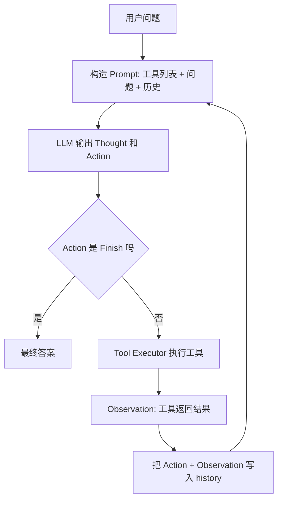
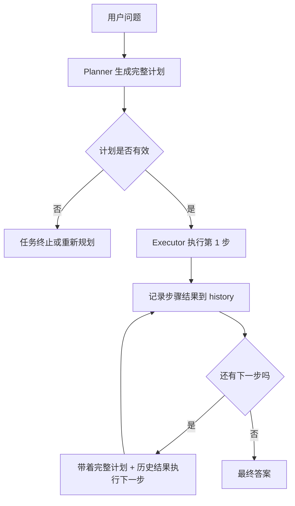
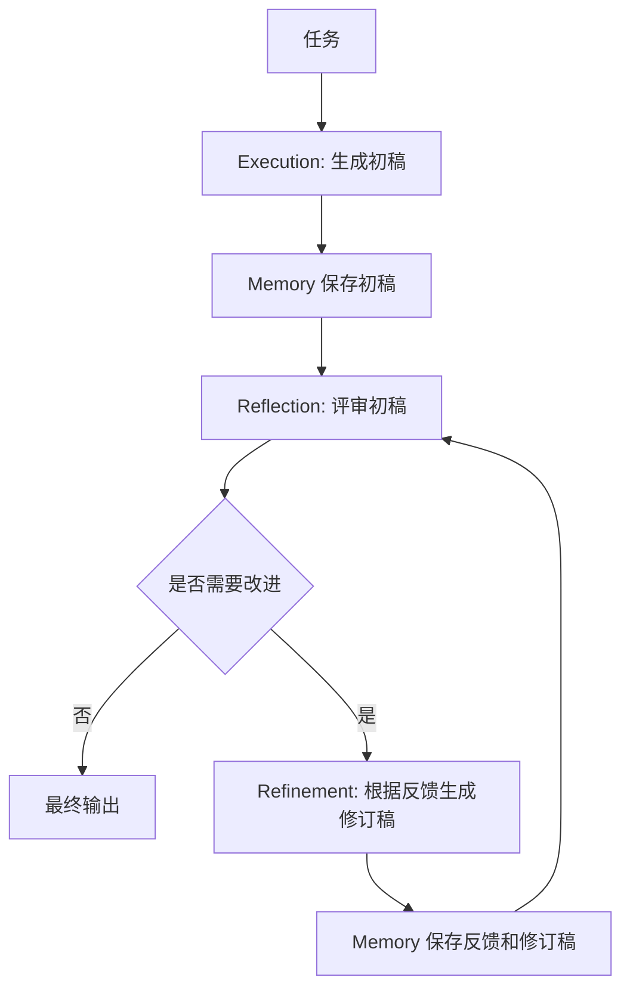

# HelloAgents 架构笔记：第 4 章 ReAct / Plan-and-Solve / Reflection

> 状态：第一遍架构梳理  
> 对应文件：`C:\Users\50469\github-projects\hello-agents\docs\chapter4\第四章 智能体经典范式构建.md`

---

## 这一章解决什么

这一章回答的是：Agent 拿到复杂任务后，应该怎么组织“思考、行动、观察、纠错”。第 1 章告诉我们 Agent 是一个闭环系统，第 4 章进一步拆成三种经典工作方式：ReAct 适合边查边做，Plan-and-Solve 适合先拆计划再执行，Reflection 适合先产出初稿再自我评审优化。对你来说，最重要的不是记住名词，而是能判断一个任务应该用哪种范式。

一句话：

```text
ReAct = 边想边做
Plan-and-Solve = 先计划后执行
Reflection = 先做一版，再反思优化
```

---

## 三种范式对比

| 范式 | 核心流程 | 最适合 | 最怕什么 | 关键状态 |
|---|---|---|---|---|
| ReAct | Thought -> Action -> Observation | 搜索、API、实时信息、工具任务 | 工具结果没有写回上下文 | action/observation 历史 |
| Plan-and-Solve | Plan -> Step Solve -> Final | 多步骤推理、报告、代码结构设计 | 计划错了还硬执行 | plan + 每步结果 |
| Reflection | Execute -> Reflect -> Refine | 代码优化、文档润色、高质量答案 | 成本高、反思标准不清 | 初稿 + 反馈 + 修订轨迹 |

---

## 核心模块

| 模块 | 职责 | 输入 | 输出 | 状态 / 依赖 |
|---|---|---|---|---|
| LLM Client | 调用模型生成思考、计划、反馈 | prompt/messages | 文本响应 | model、api、temperature |
| Tool Executor | 注册并执行工具 | tool name + args | 工具真实返回结果 | 工具列表、权限、错误 |
| ReAct Agent | 循环生成 Thought/Action，并写回 Observation | question、history、tools | final answer 或中止 | history、max_steps |
| Planner | 把复杂问题拆成步骤 | question | plan list | 输出格式约束 |
| Executor | 按计划逐步执行，并保存每步结果 | question、plan、history | step result / final answer | history |
| Memory | 保存执行和反思轨迹 | record type、content | trajectory | records |
| Reflector | 审查初稿并给出反馈 | task、draft/output | feedback | 评价标准 |
| Refiner | 根据反馈修改输出 | task、draft、feedback | improved output | previous attempts |

---

## ReAct 工作流



ReAct 的关键不是“会调用工具”，而是“工具结果必须变成下一轮推理可见的上下文”。昨天你已经抓住了核心破坏点：如果去掉 Observation，工具可能已经执行了，但返回结果没有进入 history，Planner/LLM 下一轮看不到真实反馈，只能停住或乱猜。

### ReAct 破坏实验

```text
正常：
Thought -> Action -> Tool Result -> Observation -> History -> Next Thought

破坏：
Thought -> Action -> Tool Result -> [丢失] -> Next Thought 没有依据
```

结论：ReAct 的生命线是 `history.append(Action + Observation)`。

---

## Plan-and-Solve 工作流



Plan-and-Solve 的关键是把“规划”和“执行”分离。它不像 ReAct 每一步都重新决定方向，而是先让 Planner 输出结构化计划，再让 Executor 按步骤执行。

它也有一个类似 Observation 的状态问题：每一步的结果必须进入 `history`，否则下一步无法使用前一步的产物。例如水果题里，第二步算出 30，第三步必须知道这个 30，才能算出 25。

### Plan-and-Solve 破坏实验

```text
正常：
Plan -> Step 1 Result -> history -> Step 2 使用 Step 1 Result

破坏：
Plan -> Step 1 Result -> [不记录] -> Step 2 不知道 Step 1 结果
```

结论：Plan-and-Solve 的生命线是 `history += step_result`。

---

## Reflection 工作流



Reflection 的重点不是“再问一次模型”，而是给模型一个明确的评审角色和改进标准。第 4 章的例子是代码生成：先生成一个找素数的初稿，再让严格的代码评审员指出复杂度问题，最后根据反馈优化。

它适合质量要求高、允许多轮迭代的任务；不适合实时性强、只需要大致答案的任务。

### Reflection 破坏实验

```text
正常：
Draft -> Feedback -> Refined Draft -> Feedback -> Final

破坏：
Draft -> Feedback -> [不保存反馈] -> 下一轮不知道该改什么
```

结论：Reflection 的生命线是“记住初稿、反馈、修订稿的轨迹”。

---

## 输入输出

| 阶段 | 输入 | 输出 | 失败情况 |
|---|---|---|---|
| ReAct Thought | question、tools、history | 下一步思考 | 不会选工具、格式乱 |
| ReAct Action | tool name、tool input | 工具调用请求 | 工具不存在、参数错 |
| ReAct Observation | 工具真实结果 | 可写回上下文的信息 | 结果丢失、噪声太大 |
| Planning | question | plan list | 计划不可执行、格式不可解析 |
| Solving | question、plan、history、current step | step result | 历史缺失、硬执行错误计划 |
| Reflection | task、draft、trajectory | feedback | 反馈空泛、评价标准不清 |
| Refinement | task、draft、feedback | improved output | 修改偏题、过度优化 |

---

## 关键设计点

- ReAct 的优势是适应外部世界：边查边修正，适合搜索、API、数据库、工具调用。
- Plan-and-Solve 的优势是结构稳定：先拆任务，适合逻辑链清楚的复杂任务。
- Reflection 的优势是质量提升：把初稿变成可迭代优化的产物。
- 三者都依赖状态传递：ReAct 传 Observation，Plan-and-Solve 传每步结果，Reflection 传反馈轨迹。
- `max_steps`、计划解析失败、终止条件都是安全阀，防止 Agent 无限循环或胡乱执行。

---

## 不要死扣的代码

- 不要死扣 SerpApi 的搜索实现，它只是工具例子。
- 不要死扣正则解析的细节，只要知道它在把 LLM 文本拆成 `Thought` 和 `Action`。
- 不要死扣水果题，它只是 Plan-and-Solve 的最小演示。
- 不要死扣素数算法本身，Reflection 要学的是“评审反馈如何推动优化”。

---

## 真正要理解的伪代码

### ReAct

```pseudo
history = []
while step < max_steps:
    response = llm(question, tools, history)
    thought, action = parse(response)
    if action is Finish:
        return final_answer
    observation = execute_tool(action)
    history.append(action)
    history.append(observation)
```

### Plan-and-Solve

```pseudo
plan = planner(question)
history = []
for step in plan:
    result = executor(question, plan, history, step)
    history.append(step, result)
return last_result
```

### Reflection

```pseudo
draft = execute(task)
memory.add(draft)
for round in max_rounds:
    feedback = reflect(task, draft, memory)
    if feedback says no_need_to_improve:
        return draft
    draft = refine(task, draft, feedback)
    memory.add(feedback, draft)
return draft
```

---

## 和 AI-Meeting 的对应

| AI-Meeting 场景 | 更像哪种范式 | 原因 |
|---|---|---|
| 根据简历生成面试题 | Plan-and-Solve | 先分析简历结构，再分模块出题 |
| 用户回答后追问 | ReAct | 根据回答内容动态决定下一问 |
| 面试评分和报告优化 | Reflection | 初步评分后检查是否遗漏维度、是否评价过粗 |
| 长会话状态恢复 | 三者都需要 | Redis/Mongo/MySQL 保证状态不丢 |
| SSE/WebSocket 实时返回 | ReAct 的行动反馈通道 | 把执行过程和阶段结果传回前端 |

AI-Meeting 里最该注意的是：用户每轮回答、评分中间结果、追问依据都不能丢。它们本质上就是 Agent 的 Observation、history 或 reflection trajectory。

---

## 和 Codex / Claude Code Harness 的对应

| Harness 行为 | 对应范式 |
|---|---|
| 读文件、搜索、跑测试、根据输出继续 | ReAct |
| 先列计划，再分步骤改代码 | Plan-and-Solve |
| 改完后看 diff、跑测试、复查风险 | Reflection |
| `AGENTS.md`、技能、任务单 | Context / Config |
| 测试输出、shell 日志、diff | Observation |
| 最终回复里的验证结果 | Review / Evidence |

Codex 的工作方式其实是三者混合：先 Plan-and-Solve 定方向，中间用 ReAct 调工具，最后用 Reflection 做 review。

---

## 面试讲法

> 我系统梳理过 Agent 的三种经典范式。ReAct 适合需要外部工具反馈的任务，它通过 Thought、Action、Observation 循环让模型边做边修正；Plan-and-Solve 更适合结构化复杂任务，先把问题拆成计划，再逐步执行并保存每步结果；Reflection 则用于高质量输出场景，通过执行、反思、优化循环改进初稿。我理解的重点不是概念名词，而是状态不能丢：ReAct 要保存工具 Observation，Plan-and-Solve 要保存步骤结果，Reflection 要保存反馈轨迹。

---

## 今日练习

- 图 1：画 ReAct 循环，标出 `Observation -> history -> next Thought`。
- 图 2：画 Plan-and-Solve 两阶段，标出 `step result -> history -> next step`。
- 图 3：画 Reflection 循环，标出 `draft -> feedback -> refined draft`。
- 150 字复述：用自己的话解释三种范式区别。
- 破坏实验：分别去掉 Observation、history、feedback，说明 Agent 为什么断链。
- 明天继续：第 7 章 Agent 框架，重点看模块拆分。
